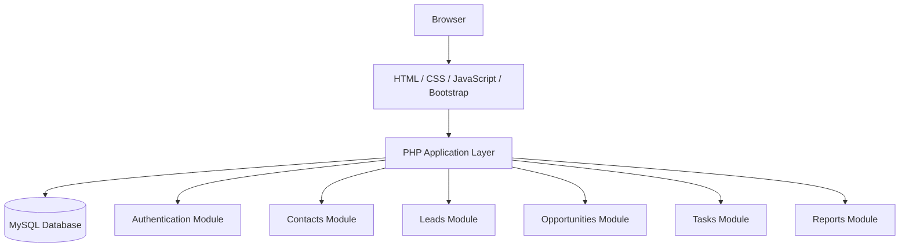

# READ.ME FILE

# Exploring CRM Systems using Generative AI

Most CRM vendors (Salesforce Einstein, HubSpot Breeze, Microsoft Copilot for Dynamics) have moved quickly to embed LLMs directly into their products. The highest ROI tends to come from content generation and summarization — tasks reps hate that AI handles well — rather than prediction, which still requires clean historical data.

# Student Information
Said Abdulle. Senior at Metro State studying Computer Science.

# AI Tools Used

Claude AI and ChatGPT

# CRM Research Findings

Claude AI was used to generate the response. The response was complete and well detailed. I used other sources to verify the details and information displayed was accurate. Results was trustworthy.

# CRM Product Comparisons

## Which commercial CRM appears most popular?

Among the commercial CRM systems researched, Salesforce CRM appears to be the most popular. Salesforce is widely recognized as the market leader in CRM software and is used by organizations ranging from small businesses to multinational corporations. Its popularity comes from its extensive customization options, large ecosystem of integrations, cloud-based architecture, and comprehensive suite of sales, marketing, and customer service tools.

## Which open-source CRM appears most mature?

Among the open-source options, SuiteCRM appears to be the most mature. SuiteCRM has been available for many years and has developed a large community, extensive documentation, and a rich set of enterprise-level features. It evolved from SugarCRM Community Edition and continues to be actively maintained.

## Which CRM would you recommend for a small business?

For a small business, I would recommend HubSpot CRM because it has a free version available, easy to use, quick deployment, and has strong contact and lead management features. Small businesses often have limited budgets and IT resources. HubSpot CRM allows them to start using CRM software without significant upfront costs while still providing room for growth.

## Which CRM would you recommend for a large enterprise?

For a large enterprise, I would recommend Salesforce CRM due to being highly scalable for thousands of users, advanced analytics, extensive customization options, and strong security and compliance features. Large enterprises requre complex workflows, integration with numerous business systems, and advanced reporting capabilities.

# Open Source CRM Evaluation

## Installation Experience

Installing Odoo was easy as it provided several options; docker, local installation, or cloud-hosted trial. Some of the challenges that occured are installing Odoo requires dependecies such as Python or PostgreSQL. In addition, configuring those dependecies can be confusing for first-time users. AI helped ny troubleshooting installation errors and providing guidance on how to install Odoo CRM.

## Product Experience

User-Friendly dashbaord impressed me because it was a clean overview of leads, opportunities, and activities. Another feature that impressed me was the customization due to how fields and modules can be customzied without extensive coding. I believe learning curve feature was missing because new users may feel overwhelmed.

# CRM Architecure Proposal

## Functional Modules

### Authentication & User Management

Purpose: Secure access and user administration.

Features:

User Login/Logout
Password Reset
User Registration
Role-Based Access Control (Admin, Manager, Sales Rep)
User Profile Management

### Dashboard 

Purpose: Provide an overview of CRM activity.

Features:

Total Customers
Active Leads
Open Opportunities
Pending Tasks
Sales Statistics
Recent Activities

### Contacts Management

Purpose: Store and manage customer information.

Features:

Add/Edit/Delete Contacts
Search and Filter Contacts
Contact History
Notes and Attachments
Import/Export Contacts

### Leads Management

Purpose: Track potential customers.

Features:

Create Leads
Assign Leads to Sales Representatives
Lead Status Tracking
Lead Conversion to Customer
Lead Source Tracking

Lead Status Examples:

New
Contacted
Qualified
Proposal Sent
Won
Lost

### Oppurtunities

Purpose: Manage potential sales deals.

Features:

Create Opportunities
Assign Opportunity Owners
Track Deal Value
Sales Stage Management
Expected Close Date
Win/Loss Tracking

Sales Stages:

Prospecting
Qualification
Proposal
Negotiation
Closed Won
Closed Lost

### Customer/Account Management

Purpose: Maintain customer records after lead conversion.

Features:

Customer Profiles
Company Information
Customer Notes
Interaction History
Customer Segmentation

### Tasks

Purpose: Manage follow-ups and daily work.

Features:

Create Tasks
Assign Tasks
Due Dates and Reminders
Meeting Scheduling
Call Logging
Activity Tracking

Activity Types:

Calls
Meetings
Emails
Follow-Ups

### Reports

Purpose: Monitor business performance.

Features:

Lead Conversion Reports
Sales Reports
User Performance Reports
Customer Growth Reports
Revenue Analytics
Activity Reports

## Useful Libraries

Bootstrap: Provides responsive layouts, forms, navigation menus, modals, buttons, and dashboards without building everything from scratch.

jQuery: Simplifies DOM manipulation, event handling, AJAX requests, and form validation.

DataTables: Adds sorting, searching, filtering, pagination, and export functionality to CRM tables such as Contacts, Leads, and Opportunities.

Chart.js: Creates interactive charts and graphs for dashboards, sales reports, lead conversion metrics, and analytics.

PHPMailer: Sends emails securely using SMTP. Useful for notifications, password resets, lead follow-ups, and customer communication.

## Security Considerations

### Authentication

Purpose

Authentication verifies a user's identity before granting access to the system.

Best Practices
Require unique usernames or email addresses.
Implement secure login and logout functionality.
Use session management to track authenticated users.
Set session timeouts after periods of inactivity.
Consider Multi-Factor Authentication (MFA) for administrators.
Prevent brute-force attacks by limiting login attempts.
Example

A sales representative must enter valid credentials before accessing customer records.

### Authorization

Purpose

Authorization determines what an authenticated user is allowed to access or modify.

Best Practices
Implement Role-Based Access Control (RBAC).
Assign permissions based on user roles.
Restrict access to sensitive modules.
Validate permissions on the server side, not just the client side.

### Password Security

Purpose

Protect user credentials from theft and unauthorized access.

Best Practices
Never store passwords in plain text.
Use PHP's password_hash() function for password storage.
Verify passwords using password_verify().
Enforce strong password requirements:
Minimum 8–12 characters
Uppercase and lowercase letters
Numbers
Special characters
Require password changes after suspected compromise.
Use secure password reset procedures.

### SQL Injection Prevention

Purpose

Prevent attackers from manipulating database queries.

Risk Example

Unsafe code:

$sql = "SELECT * FROM users WHERE email = '$email'";

An attacker could inject malicious SQL commands.

Best Practices
Use prepared statements.
Use parameterized queries.
Validate user input.
Limit database permissions.

### Cross-Site Scripting

Purpose

Prevent attackers from injecting malicious JavaScript into web pages.

Risk Example

A user submits:

If displayed without filtering, the script executes in other users' browsers.

Best Practices
Escape all output before displaying it.
Sanitize user input.
Use Content Security Policy (CSP).
Validate form data.
Secure Example
echo htmlspecialchars(
    $userInput,
    ENT_QUOTES,
    'UTF-8'
);
Benefits
Protects session cookies.
Prevents malicious scripts from running.

### Data Privacy

Purpose

Protect customer and organizational information from unauthorized access.

Types of Sensitive CRM Data
Customer names
Email addresses
Phone numbers
Addresses
Sales records
Support tickets
Employee information
Best Practices
Use HTTPS for all communication.
Encrypt sensitive data when appropriate.
Limit access based on job responsibilities.
Log and monitor access to sensitive records.
Regularly back up data.
Remove unnecessary personal data.
Comply with privacy regulations when applicable.
Example

Only managers and administrators should have access to company-wide sales reports.

## MVP Proposal

### Version 1 Features

#### User Authentication

Allows users to securely access the system.

Features:

Login
Logout
Password hashing
Session management

Why it's important:

Protects customer data
Supports multiple users

#### Dashboard

Provides a quick overview of CRM activity.

Features:

Total Contacts
Total Leads
Open Opportunities
Upcoming Tasks

Why it's important:

Gives users a summary of their workload and sales pipeline.

#### Contacts Management

Stores customer information.

Features:

Add Contact
Edit Contact
Delete Contact
Search Contacts
View Contact Details

Stored Information:

Name
Email
Phone Number
Company
Notes

Why it's important:

Contacts are the foundation of any CRM.

#### Leads Management

Tracks potential customers.

Features:

Add Lead
Edit Lead
Delete Lead
Assign Lead Status

Lead Statuses:

New
Contacted
Qualified
Lost

Why it's important:

Helps track prospects through the sales process.

#### Opportunities

Tracks potential sales deals.

Features:

Create Opportunity
Link Opportunity to Contact
Set Deal Value
Update Sales Stage

Stages:

Prospecting
Proposal
Negotiation
Won
Lost

Why it's important:

Allows users to track revenue opportunities.

## Architecture Diagram

# Prompt Engineering 

## Compare Salesforce, Hubspot, and Zoho CRM for a 50-person company. Include pricing, pros, cons, and which one you recommend.

## What modules should a CRM system have? We are using PHP, mySQL, Bootstrap, and jQuery

## Design a MySQL database schema for a CRM system. Include tables for: users, contacts, leads, opportunities, and tasks.

## How can we use AI to improve each module of our CRM? Focus on features a small sales team would actually use.

## Show the folder structure for a PHP CRM project with no framework.

# Lessons Learned

## What AI did well

AI did a good job producing a well structured module list and adapted output format on request.

## What AI struggled with

AI struggled with vendor specific details- exact feature availability per plan tier can be outdated or inaccurate.

## What required validation

CRM pricing and plan tiers. Always ensure directly on vendor websites before presenting to stakeholders.

## What was surprising

Context was maintained across the entire converstion. Modules from previous prompts appeared correctly in later schemas.

## What to do differently next time

What I would do next time is ask for one thing at a time, splitting 'modules + schema + folder structure" into separate prompts gives cleaner, more focused results.

## Would you trsut AI for software

Yes, with conditions. Trust AI for structure, patterns, and first-draft output.
